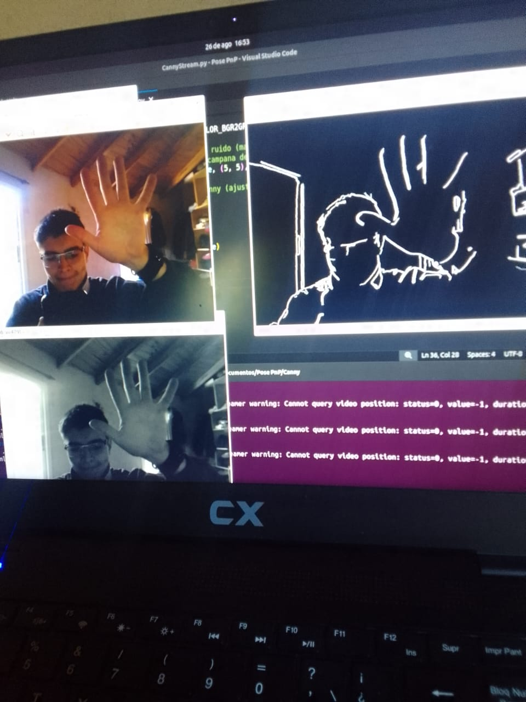
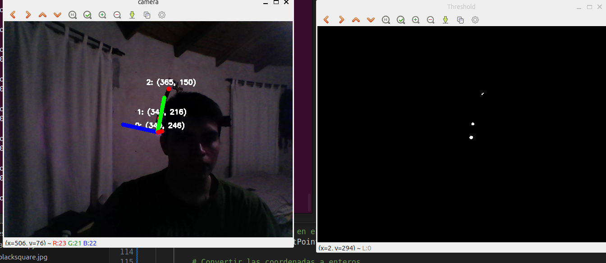
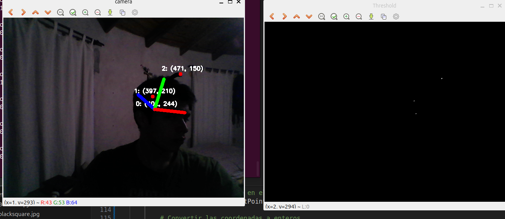
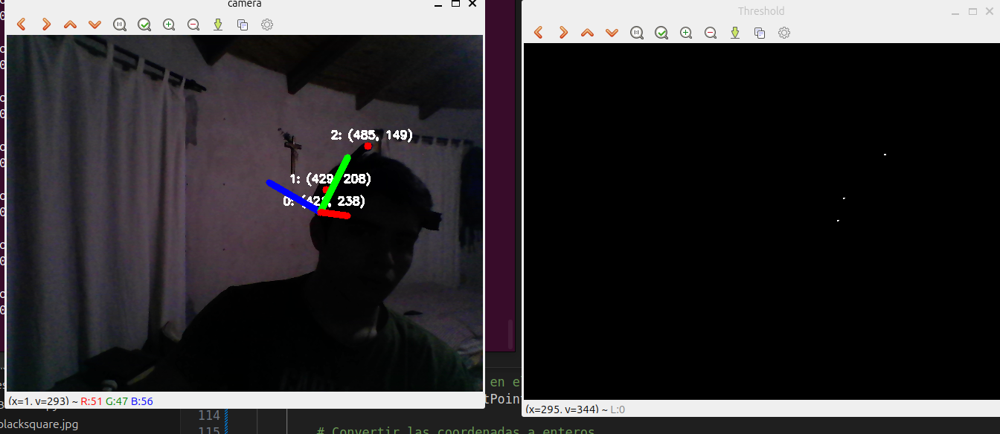

# Determinacion de la Pose utilizando algoritmos PnP
Este es un repositorio personal donde colocare el codigo relacionado al0 sub-proyecto del proyecto HDM (Helmet Mounted Display) de la facultad de ingenieria del CRU CORDOBA IUA

## Tabla de Contenidos

1. [Descripcion](#Descripcion)
2. [Documentacion](#Documentacion)
3. [Multimedia](#Multimedia)

## Descripcion
El proyecto en escencia se trata de un casco de asistencia para pilotos de aeronaves.
El sub-proyecto trata de determinar la pose del casco (Direccion donde mira el piloto), utilizando software para el reemplazo de la solucion hardware con la que se cuenta actualmente. Este "cambio de tecnologias"
se debe a que en la actualidad
el dispositivo pierde presicion pasado un cierto tiempo de vuelo y se espera obtener mejores resultados con el uso de camaras apoyadas en la vision inteligente.
Para la determinacion de la pose, en este caso, se planea el uso de algoritmos PnP corriendo en dispositivos embebidos.
Mi trabajo durate el proyecto sera realizar, en conjunto de compañeros, el estudio experimental y exploratorio de algoritmos para determinar cual es el mejor segun nuestra circunstancia.
Se buscan pocas cargas computacionales y la mayor presicion posible.

### Documentacion

- Aqui colocare documentacion de interes

### Multimedia
#### Deteccion de bordes con canny
Primer metodo propuesto para la deteccion de bordes

#### Thresholding y Centroide
Se calcula centroide de perimetros obtenidos con metodo de Thresholding (otro metodo propuesto para encontrar perimetros mas velozmente)

#### PnP & useExtrinsicGuess
Primeras pruebas de PnP, dado el patron de 3 puntos se utiliza estimacion inicial con ExtrinsicGuess en SOLVE_PNPITERATIVE (metodo default). Igualmente continuan los errores de presicion

